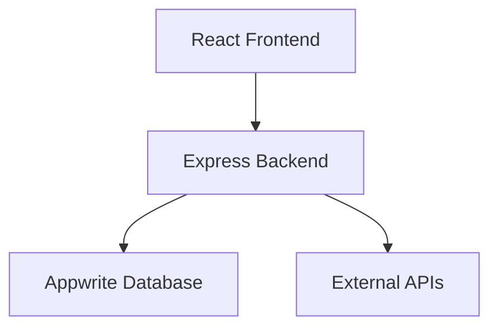
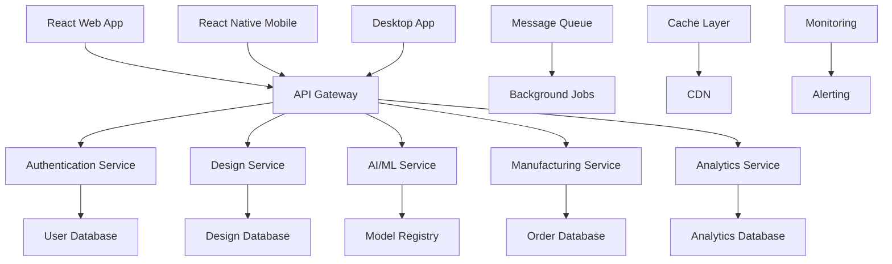

# 🗺️ Boutique-To-Box Development Roadmap

**Vision**: Transform Boutique-To-Box into the world's leading AI-powered fashion design and manufacturing platform with enterprise-grade scalability, automation, and user experience.

## 📊 Current State Analysis

### ✅ Existing Strengths
- React + TypeScript frontend with modern UI components
- Node.js backend with Appwrite integration
- AI integration foundation (RunwayML, GPT-4)
- 3D visualization with Three.js
- Manufacturing integration (Printful)
- Comprehensive documentation and contribution guidelines

### ⚠️ Areas for Improvement
- Limited testing coverage
- Basic authentication system
- No real-time collaboration
- Minimal monitoring and observability
- Basic CI/CD pipeline
- Limited scalability architecture
- No mobile application
- Basic AI model integration

---

## 🎯 Strategic Roadmap (2024-2026)

### Phase 1: Foundation & Stability (Q1 2024 - 3 months)
**Goal**: Establish robust foundation with comprehensive testing, monitoring, and basic scalability

#### 🔧 Technical Infrastructure
- [ ] **Testing Framework Implementation**
  - Unit tests for all components (90%+ coverage)
  - Integration tests for API endpoints
  - E2E tests with Playwright
  - Visual regression testing
  - Performance testing with Lighthouse CI

- [ ] **Monitoring & Observability**
  - Sentry for error tracking and performance monitoring
  - DataDog/New Relic for application performance monitoring
  - Custom analytics dashboard with real-time metrics
  - Health check endpoints and status page
  - Automated alerting system

- [ ] **Enhanced CI/CD Pipeline**
  - Multi-environment deployment (dev, staging, prod)
  - Automated security scanning (SAST, DAST)
  - Dependency vulnerability scanning
  - Automated performance testing
  - Blue-green deployment strategy

- [ ] **Database Optimization**
  - Database indexing optimization
  - Query performance analysis
  - Connection pooling implementation
  - Database backup and recovery automation
  - Data archiving strategy

#### 🎨 User Experience Improvements
- [ ] **Enhanced UI/UX**
  - Design system documentation and Storybook
  - Accessibility compliance (WCAG 2.1 AA)
  - Dark mode implementation
  - Responsive design optimization
  - Loading states and skeleton screens

- [ ] **Performance Optimization**
  - Code splitting and lazy loading
  - Image optimization and WebP support
  - Service worker for offline functionality
  - CDN integration for static assets
  - Bundle size optimization

#### 🔐 Security Enhancements
- [ ] **Advanced Authentication**
  - Multi-factor authentication (MFA)
  - Social login providers (Google, Apple, GitHub)
  - Session management improvements
  - Password policy enforcement
  - Account lockout protection

- [ ] **API Security**
  - Rate limiting implementation
  - API key management system
  - Request/response encryption
  - CORS policy optimization
  - Input validation and sanitization

### Phase 2: Advanced Features & AI Enhancement (Q2 2024 - 4 months)
**Goal**: Implement advanced AI capabilities, real-time features, and mobile support

#### 🤖 AI/ML Platform Enhancement
- [ ] **Advanced AI Models**
  - Custom fashion-specific AI model training
  - Style transfer and pattern generation
  - Fabric texture synthesis
  - Color palette generation
  - Trend prediction algorithms

- [ ] **AI Model Management**
  - Model versioning and A/B testing
  - Model performance monitoring
  - Automated model retraining pipeline
  - Edge computing for faster inference
  - Custom AI model marketplace

- [ ] **Computer Vision Features**
  - Body measurement from photos
  - Fabric recognition and analysis
  - Quality control automation
  - Virtual try-on improvements
  - Pose estimation for fitting

#### 🌐 Real-time Collaboration
- [ ] **Live Design Collaboration**
  - WebSocket-based real-time editing
  - Collaborative design canvas
  - Version control for designs
  - Comment and feedback system
  - Design history and rollback

- [ ] **Communication Features**
  - In-app messaging system
  - Video call integration for consultations
  - Design review and approval workflow
  - Notification system
  - Activity feeds and updates

#### 📱 Mobile Application
- [ ] **React Native Mobile App**
  - Cross-platform mobile application
  - Camera integration for measurements
  - AR try-on functionality
  - Push notifications
  - Offline design capabilities

- [ ] **Mobile-Specific Features**
  - Gesture-based design manipulation
  - Voice commands for design
  - Mobile payment integration
  - Location-based services
  - Social sharing features

### Phase 3: Enterprise & Scalability (Q3 2024 - 4 months)
**Goal**: Build enterprise-grade features with massive scalability and advanced automation

#### 🏢 Enterprise Features
- [ ] **Multi-tenancy Architecture**
  - Organization and team management
  - Role-based access control (RBAC)
  - Custom branding and white-labeling
  - Enterprise SSO integration
  - Audit logging and compliance

- [ ] **Advanced Analytics**
  - Business intelligence dashboard
  - Custom report generation
  - Predictive analytics
  - ROI tracking and optimization
  - Market trend analysis

- [ ] **Integration Platform**
  - REST and GraphQL APIs
  - Webhook system for integrations
  - Third-party app marketplace
  - SDK for multiple languages
  - Enterprise connectors (SAP, Oracle)

#### ⚡ Scalability & Performance
- [ ] **Microservices Architecture**
  - Service decomposition strategy
  - API Gateway implementation
  - Service mesh (Istio/Linkerd)
  - Distributed caching (Redis Cluster)
  - Message queue system (RabbitMQ/Kafka)

- [ ] **Cloud-Native Infrastructure**
  - Kubernetes orchestration
  - Auto-scaling policies
  - Multi-region deployment
  - Disaster recovery planning
  - Infrastructure as Code (Terraform)

- [ ] **Database Scaling**
  - Database sharding strategy
  - Read replicas implementation
  - Caching layer optimization
  - Data partitioning
  - NoSQL integration for specific use cases

#### 🤖 Advanced Automation
- [ ] **Intelligent Automation**
  - Automated design optimization
  - Smart inventory management
  - Predictive maintenance
  - Automated quality assurance
  - Dynamic pricing algorithms

- [ ] **DevOps Automation**
  - GitOps workflow implementation
  - Automated testing at scale
  - Infrastructure monitoring
  - Automated incident response
  - Capacity planning automation

### Phase 4: Innovation & Market Leadership (Q4 2024 - 6 months)
**Goal**: Establish market leadership through cutting-edge features and global expansion

#### 🌍 Global Expansion
- [ ] **Internationalization**
  - Multi-language support (20+ languages)
  - Currency and payment localization
  - Regional compliance (GDPR, CCPA)
  - Local manufacturing partnerships
  - Cultural design preferences

- [ ] **Marketplace Platform**
  - Designer marketplace
  - Template and pattern library
  - Revenue sharing system
  - Quality certification program
  - Community-driven content

#### 🔬 Cutting-Edge Technologies
- [ ] **Blockchain Integration**
  - NFT support for unique designs
  - Smart contracts for royalties
  - Supply chain transparency
  - Decentralized design ownership
  - Cryptocurrency payment support

- [ ] **Advanced AR/VR**
  - Virtual showroom experiences
  - Haptic feedback integration
  - Mixed reality design tools
  - Virtual fashion shows
  - Metaverse integration

- [ ] **Sustainability Features**
  - Carbon footprint tracking
  - Sustainable material recommendations
  - Waste reduction optimization
  - Circular economy features
  - Environmental impact reporting

#### 🧠 Next-Gen AI
- [ ] **Generative AI Platform**
  - Custom AI model training platform
  - Prompt engineering tools
  - AI-generated fashion collections
  - Personalized design recommendations
  - Automated trend forecasting

- [ ] **AI Ethics & Governance**
  - Bias detection and mitigation
  - Explainable AI implementation
  - AI model governance
  - Ethical AI guidelines
  - Transparency reporting

---

## 🏗️ Technical Architecture Evolution

### Current Architecture


### Target Architecture (Phase 4)


---

## 📈 Feature Roadmap by Category

### 🎨 Design & Creation
| Feature | Phase | Priority | Complexity |
|---------|-------|----------|------------|
| Advanced AI Design Generation | 2 | High | High |
| Real-time Collaborative Editing | 2 | High | High |
| 3D Design Manipulation | 1 | Medium | Medium |
| Pattern Library & Templates | 2 | High | Medium |
| Custom Fabric Designer | 3 | Medium | High |
| Voice-Controlled Design | 2 | Low | High |
| Gesture-Based Mobile Design | 2 | Medium | Medium |
| AI Style Transfer | 2 | High | High |

### 🛍️ E-commerce & Manufacturing
| Feature | Phase | Priority | Complexity |
|---------|-------|----------|------------|
| Advanced Order Management | 1 | High | Medium |
| Multi-Vendor Marketplace | 4 | High | High |
| Inventory Management | 3 | High | Medium |
| Quality Control Automation | 3 | Medium | High |
| Sustainable Manufacturing | 4 | Medium | Medium |
| Custom Sizing Algorithm | 2 | High | High |
| Bulk Order Processing | 3 | Medium | Medium |
| Supply Chain Tracking | 3 | Medium | High |

### 👥 Social & Community
| Feature | Phase | Priority | Complexity |
|---------|-------|----------|------------|
| Designer Portfolio | 2 | High | Medium |
| Social Sharing & Reviews | 2 | Medium | Low |
| Design Competitions | 3 | Medium | Medium |
| Influencer Partnerships | 3 | Low | Medium |
| Community Challenges | 3 | Medium | Low |
| Live Streaming Fashion Shows | 4 | Low | High |
| Virtual Fashion Events | 4 | Low | High |
| Design Collaboration Tools | 2 | High | High |

### 📊 Analytics & Business Intelligence
| Feature | Phase | Priority | Complexity |
|---------|-------|----------|------------|
| Advanced Analytics Dashboard | 1 | High | Medium |
| Predictive Analytics | 3 | High | High |
| A/B Testing Platform | 2 | Medium | Medium |
| Customer Behavior Analysis | 2 | High | Medium |
| Market Trend Prediction | 3 | High | High |
| ROI Optimization | 3 | Medium | Medium |
| Custom Report Builder | 3 | Medium | Medium |
| Real-time Metrics | 1 | High | Medium |

---

## 🚀 Implementation Strategy

### Development Methodology
- **Agile/Scrum** with 2-week sprints
- **Feature flags** for gradual rollouts
- **A/B testing** for new features
- **Continuous integration/deployment**
- **User feedback loops** for validation

### Team Structure (Recommended)
```
Product Team (12-15 people)
├── Frontend Team (4 people)
│   ├── Senior React Developer (Lead)
│   ├── React Developer
│   ├── Mobile Developer (React Native)
│   └── UI/UX Designer
├── Backend Team (4 people)
│   ├── Senior Backend Developer (Lead)
│   ├── Backend Developer
│   ├── DevOps Engineer
│   └── Database Specialist
├── AI/ML Team (3 people)
│   ├── ML Engineer (Lead)
│   ├── Data Scientist
│   └── AI Research Engineer
├── QA Team (2 people)
│   ├── QA Engineer
│   └── Automation Test Engineer
└── Product Management (2 people)
    ├── Product Manager
    └── Technical Product Manager
```

### Technology Stack Evolution

#### Phase 1 Additions
- **Testing**: Vitest, Playwright, Jest
- **Monitoring**: Sentry, DataDog
- **CI/CD**: GitHub Actions, Docker
- **Database**: PostgreSQL, Redis

#### Phase 2 Additions
- **Mobile**: React Native, Expo
- **Real-time**: Socket.io, WebRTC
- **AI/ML**: TensorFlow.js, PyTorch
- **Search**: Elasticsearch

#### Phase 3 Additions
- **Microservices**: Node.js, Python, Go
- **Orchestration**: Kubernetes, Docker Swarm
- **Message Queue**: RabbitMQ, Apache Kafka
- **API Gateway**: Kong, AWS API Gateway

#### Phase 4 Additions
- **Blockchain**: Ethereum, Polygon
- **AR/VR**: WebXR, Unity
- **Edge Computing**: Cloudflare Workers
- **AI Platform**: Custom ML Pipeline

---

## 💰 Investment & Resource Planning

### Budget Estimation (Annual)

#### Phase 1 (Foundation) - $150K
- Development Team: $120K
- Infrastructure: $15K
- Tools & Services: $10K
- Marketing: $5K

#### Phase 2 (Advanced Features) - $300K
- Expanded Team: $240K
- AI/ML Infrastructure: $30K
- Mobile Development: $20K
- Marketing & Growth: $10K

#### Phase 3 (Enterprise) - $500K
- Full Team: $400K
- Enterprise Infrastructure: $50K
- Compliance & Security: $30K
- Sales & Marketing: $20K

#### Phase 4 (Innovation) - $750K
- Research & Development: $300K
- Global Expansion: $200K
- Advanced Infrastructure: $150K
- Marketing & Partnerships: $100K

### Revenue Projections

#### Year 1: $50K - $100K
- Freemium users: 1,000
- Pro subscribers: 100 ($50/month)
- API usage: $10K

#### Year 2: $500K - $1M
- Freemium users: 10,000
- Pro subscribers: 1,000
- Enterprise clients: 10 ($2K/month)
- Marketplace revenue: $200K

#### Year 3: $2M - $5M
- Global user base: 100,000
- Enterprise clients: 100
- Marketplace ecosystem: $1M
- API platform: $500K

---

## 🎯 Success Metrics & KPIs

### Technical Metrics
- **Performance**: Page load time < 2s, API response < 500ms
- **Reliability**: 99.9% uptime, < 0.1% error rate
- **Scalability**: Support 100K concurrent users
- **Security**: Zero critical vulnerabilities

### Business Metrics
- **User Growth**: 50% month-over-month growth
- **Revenue**: $5M ARR by Year 3
- **Market Share**: Top 3 in AI fashion design
- **Customer Satisfaction**: NPS > 50

### Product Metrics
- **Engagement**: 70% monthly active users
- **Retention**: 80% user retention after 6 months
- **Conversion**: 15% freemium to paid conversion
- **Design Success**: 90% design completion rate

---

## 🚨 Risk Management

### Technical Risks
- **AI Model Performance**: Continuous model monitoring and improvement
- **Scalability Challenges**: Gradual scaling with performance testing
- **Security Vulnerabilities**: Regular security audits and penetration testing
- **Third-party Dependencies**: Vendor diversification and fallback plans

### Business Risks
- **Market Competition**: Continuous innovation and differentiation
- **Regulatory Changes**: Compliance monitoring and adaptation
- **Economic Downturns**: Flexible pricing and cost optimization
- **Talent Acquisition**: Competitive compensation and remote work options

### Mitigation Strategies
- **Feature Flags**: Gradual rollout of new features
- **A/B Testing**: Data-driven decision making
- **Monitoring**: Proactive issue detection and resolution
- **Documentation**: Comprehensive knowledge management

---

## 🤝 Community & Ecosystem

### Open Source Strategy
- **Core Platform**: Open source with enterprise features
- **Plugin Architecture**: Community-driven extensions
- **API First**: Enable third-party integrations
- **Developer Program**: SDK, documentation, and support

### Partnership Opportunities
- **Fashion Brands**: Integration partnerships
- **Educational Institutions**: Academic collaborations
- **Technology Vendors**: Strategic alliances
- **Manufacturing Partners**: Global supply chain

### Community Building
- **Developer Community**: GitHub, Discord, Stack Overflow
- **User Community**: Forums, social media, events
- **Content Creation**: Tutorials, webinars, documentation
- **Events**: Conferences, hackathons, meetups

---

## 📅 Quarterly Milestones

### Q1 2024: Foundation
- ✅ Comprehensive testing suite
- ✅ Monitoring and observability
- ✅ Enhanced CI/CD pipeline
- ✅ Security improvements

### Q2 2024: Advanced Features
- 🎯 AI model enhancements
- 🎯 Real-time collaboration
- 🎯 Mobile application launch
- 🎯 Performance optimization

### Q3 2024: Enterprise Ready
- 🎯 Microservices architecture
- 🎯 Enterprise features
- 🎯 Scalability improvements
- 🎯 Advanced automation

### Q4 2024: Market Leadership
- 🎯 Global expansion
- 🎯 Marketplace platform
- 🎯 Cutting-edge technologies
- 🎯 Innovation leadership

---

This roadmap provides a comprehensive path to transform Boutique-To-Box into a world-class platform. The phased approach ensures steady progress while maintaining quality and user satisfaction. Regular reviews and adjustments will be made based on market feedback and technological advances.

**Next Steps**: 
1. Review and prioritize features based on current resources
2. Set up development team structure
3. Begin Phase 1 implementation
4. Establish feedback loops with early users
5. Secure funding for sustained development

🚀 **Let's build the future of fashion technology together!**