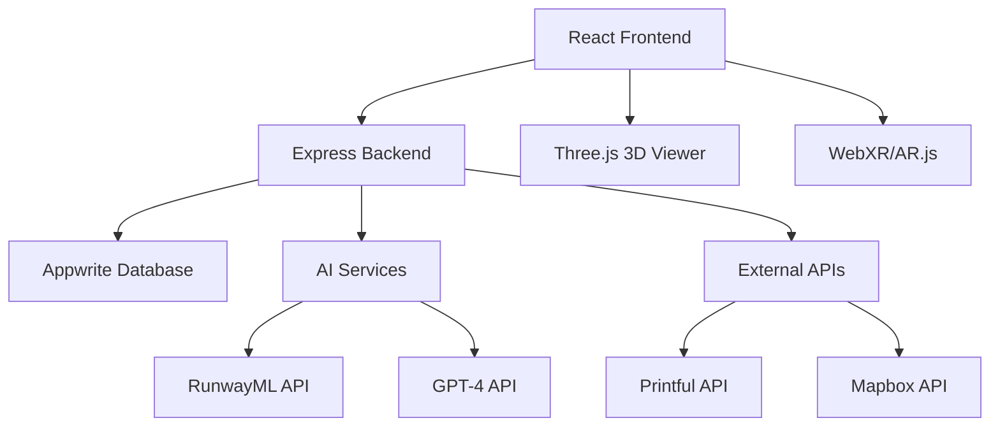

# 🛠️ Development Guide

This guide provides detailed information for developers working on Boutique-To-Box.

## 📋 Table of Contents
- [Architecture Overview](#architecture-overview)
- [Tech Stack](#tech-stack)
- [Project Structure](#project-structure)
- [Development Workflow](#development-workflow)
- [API Documentation](#api-documentation)
- [Database Schema](#database-schema)
- [Testing Strategy](#testing-strategy)
- [Performance Guidelines](#performance-guidelines)
- [Security Considerations](#security-considerations)

## 🏗️ Architecture Overview



## 🔧 Tech Stack

### Frontend
- **Framework**: React 18 with TypeScript
- **Build Tool**: Vite
- **Styling**: Tailwind CSS + shadcn/ui
- **State Management**: React Query + Context API
- **3D Graphics**: Three.js
- **AR/VR**: WebXR + AR.js
- **Routing**: React Router v6

### Backend
- **Runtime**: Node.js
- **Framework**: Express.js
- **Database**: Appwrite
- **Authentication**: Appwrite Auth
- **File Storage**: Appwrite Storage
- **AI Integration**: RunwayML, OpenAI GPT-4

### DevOps & Tools
- **Version Control**: Git + GitHub
- **CI/CD**: GitHub Actions
- **Deployment**: Vercel (Frontend), Railway (Backend)
- **Monitoring**: Sentry
- **Analytics**: Google Analytics 4

## 📁 Project Structure

```
Boutique-To-Box/
├── src/                          # Frontend source
│   ├── components/               # Reusable components
│   │   ├── ui/                  # shadcn/ui components
│   │   ├── forms/               # Form components
│   │   ├── layout/              # Layout components
│   │   └── features/            # Feature-specific components
│   ├── pages/                   # Page components
│   ├── hooks/                   # Custom React hooks
│   ├── services/                # API services
│   ├── utils/                   # Utility functions
│   ├── types/                   # TypeScript definitions
│   ├── contexts/                # React contexts
│   └── assets/                  # Static assets
├── backend/                     # Backend source
│   ├── routes/                  # API routes
│   ├── middleware/              # Express middleware
│   ├── services/                # Business logic
│   ├── utils/                   # Backend utilities
│   └── config/                  # Configuration files
├── docs/                        # Documentation
├── tests/                       # Test files
│   ├── __mocks__/              # Test mocks
│   ├── fixtures/               # Test fixtures
│   └── utils/                  # Test utilities
└── .github/                     # GitHub workflows
```

## 🔄 Development Workflow

### 1. Branch Strategy
- `main`: Production-ready code
- `develop`: Integration branch for features
- `feature/*`: New features
- `fix/*`: Bug fixes
- `hotfix/*`: Critical production fixes

### 2. Commit Convention
```bash
feat: add new design generation feature
fix: resolve authentication timeout issue
docs: update API documentation
style: format code with prettier
refactor: optimize image processing pipeline
test: add unit tests for user service
chore: update dependencies
```

### 3. Code Review Process
1. Create feature branch from `develop`
2. Implement changes with tests
3. Create PR to `develop`
4. Automated checks must pass
5. At least one maintainer review
6. Merge after approval

## 📡 API Documentation

### Authentication Endpoints
```typescript
POST /api/auth/login
POST /api/auth/register
POST /api/auth/logout
GET  /api/auth/me
```

### Design Generation Endpoints
```typescript
POST /api/designs/generate
GET  /api/designs/:id
PUT  /api/designs/:id
DELETE /api/designs/:id
GET  /api/designs/user/:userId
```

### AI Integration Endpoints
```typescript
POST /api/ai/analyze-style
POST /api/ai/generate-pattern
POST /api/ai/enhance-design
```

### Example API Usage
```typescript
// Generate new design
const response = await fetch('/api/designs/generate', {
  method: 'POST',
  headers: {
    'Content-Type': 'application/json',
    'Authorization': `Bearer ${token}`
  },
  body: JSON.stringify({
    prompt: "Modern minimalist dress",
    style: "casual",
    colors: ["#FF6B6B", "#4ECDC4"]
  })
});
```

## 🗄️ Database Schema

### Users Collection
```typescript
interface User {
  $id: string;
  email: string;
  name: string;
  avatar?: string;
  subscription: 'free' | 'pro' | 'enterprise';
  createdAt: string;
  updatedAt: string;
}
```

### Designs Collection
```typescript
interface Design {
  $id: string;
  userId: string;
  title: string;
  description: string;
  prompt: string;
  imageUrl: string;
  modelUrl?: string;
  tags: string[];
  isPublic: boolean;
  likes: number;
  createdAt: string;
  updatedAt: string;
}
```

## 🧪 Testing Strategy

### Unit Tests
- Component testing with React Testing Library
- Service function testing with Jest
- Utility function testing

### Integration Tests
- API endpoint testing
- Database integration testing
- Third-party service mocking

### E2E Tests
- User journey testing with Playwright
- Cross-browser compatibility
- Mobile responsiveness

### Test Commands
```bash
# Run all tests
npm test

# Run tests with coverage
npm run test:coverage

# Run E2E tests
npm run test:e2e

# Run specific test file
npm test -- UserService.test.ts
```

## ⚡ Performance Guidelines

### Frontend Optimization
- Use React.memo for expensive components
- Implement virtual scrolling for large lists
- Lazy load images and components
- Optimize bundle size with code splitting

### Backend Optimization
- Implement caching with Redis
- Use database indexing
- Optimize API response sizes
- Implement rate limiting

### 3D Performance
- Use LOD (Level of Detail) for 3D models
- Implement frustum culling
- Optimize texture sizes
- Use instancing for repeated objects

## 🔒 Security Considerations

### Frontend Security
- Sanitize user inputs
- Implement CSP headers
- Use HTTPS only
- Validate all API responses

### Backend Security
- Input validation and sanitization
- Rate limiting and DDoS protection
- Secure authentication tokens
- Regular security audits

### API Security
- Implement proper CORS policies
- Use API key authentication
- Encrypt sensitive data
- Monitor for suspicious activity

## 🚀 Deployment

### Environment Variables
```bash
# Frontend (.env)
VITE_API_URL=http://localhost:3001
VITE_APPWRITE_ENDPOINT=https://cloud.appwrite.io/v1
VITE_APPWRITE_PROJECT_ID=your_project_id
VITE_RUNWAYML_API_KEY=your_runway_key

# Backend (.env)
PORT=3001
APPWRITE_ENDPOINT=https://cloud.appwrite.io/v1
APPWRITE_PROJECT_ID=your_project_id
APPWRITE_API_KEY=your_api_key
OPENAI_API_KEY=your_openai_key
```

### Build Commands
```bash
# Frontend build
npm run build

# Backend build (if using TypeScript)
cd backend && npm run build
```

## 📊 Monitoring & Analytics

### Error Tracking
- Sentry for error monitoring
- Custom error boundaries
- API error logging

### Performance Monitoring
- Web Vitals tracking
- API response time monitoring
- Database query optimization

### User Analytics
- Google Analytics 4
- Custom event tracking
- User journey analysis

## 🤝 Contributing

See [CONTRIBUTING.md](../CONTRIBUTING.md) for detailed contribution guidelines.

## 📚 Additional Resources

- [React Documentation](https://reactjs.org/docs)
- [Appwrite Documentation](https://appwrite.io/docs)
- [Three.js Documentation](https://threejs.org/docs)
- [Tailwind CSS Documentation](https://tailwindcss.com/docs)